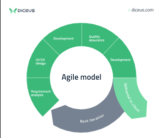
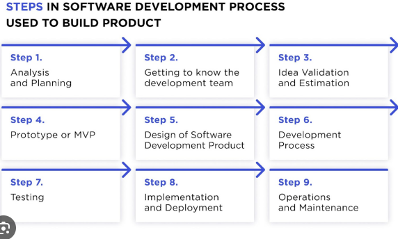

# **Week 6**

### Grading

Task #|Points|Description|
-----|:---:|----------|
Task 1 | 1 | Secure Running Environment
Task 2 | 1 | Supply Chain Attacks 
Task 3 | 2 | Securing docker

---

# Tasks

### Task 1: Secure Running Environment?

It is important to understand the differences and security capabilities of the concepts listed below. Choose two out of the four concepts and write a short explanation of them and their respective security capabilities and incapabilities.
Focus on giving a good overview of the security limits for the concepts.

- TPM
- Enclave
- Container
- Virtualization

**Max 300 words excluding sources.**

---
Enclave: Secure execution environments designed to protect code and data from malicious actors and privileged users. They ensure confidentiality and integrity of the data and code within them. It has some security incapabilities, for example Enclaves aren't invunerable to all types of attacks, it can be vunerable to side-channel attacks and they are limited resource-wise, performing with a limited memory and CPU power.  Enclaves are suitable for scenarios where strong security is required, such as protecting cryptographic keys or sensitive data, but they might not be practical for all types of applications due to their performance overhead and resource constraints.

Container: Containers provide a level of isolation for running applications by packaging them along with their dependencies, libraries, and configuration. They share the host's kernel, so basically means that if the kernel is vunerable, it could impact on the containers running on the same host. Containers have a larger attack surface compared to enclaves because they rely on the host operating system and its security mechanisms. An attacker who gains control of the host could potentially compromise all containers on that host.
Containers are a versatile solution for deploying applications in various environments, from development to production. They are suitable for scenarios where strong isolation is not a primary concern, but scalability, flexibility, and ease of deployment are important.

sources: CHATgpt, https://support.apple.com/pt-br/guide/security/sec59b0b31ff/web, https://www.redhat.com/en/topics/security/container-security

### Task 2: Supply Chain Attacks

In this task we are looking at the difficulties handling supply chain attacks, specifically detecting and responding.

For this scenario you are working for a networking hardware and software company, and you're tasked with securing their supply chain. The company manufactures and sells routers with their own software and other various networking accessories B2B and B2C.  Some parts for the routers have to be outsourced and manufactured outside company.

Research and write a report on concrete actions you could implement on the supply chain, trying to make sure the product is not being tampered or researched with malicious intent. Keep in mind, that the supply chain includes third party tools, code and update providing, as well as other companies maintaining firmware. Your supply chain must include **at least four** actors including your company. You should analyze the points of concerns in the report.

Provide reasoning for your choices and analyze what potential problems and additional actions these choices might require from your company.

Probable actors in such supply chains include, but are not limited to:

- Employees, in-house and outsourced
- Transportation companies
- Retail companies
- Storage facilities
- Part suppliers

<details>
<summary>Example supply chain</summary>
<br>

Hardware
- 3rd party company X manufactures antennas for the routers
- Truck company Y transports them to 
- Factory Z, where it is assembled by workers 
- Y transports them to resellers A and B

<br>

Software
- Own employees create it
- Company C provides contractual coders for help
- Company D audits software
- Company E hosts internal tools

<br>
You can use the examply supply chain in your task if you want to.
<br>
</details>

Some concepts to help you get started:
- NDR (Network Detection and Response)
- UBA (User Behavioral Analytics)
- EDR (Endpoint Detection and Response)
- TPM (Trusted Platform Module)

Real-life cases for inspiration:
- [SolarWinds](https://www.gao.gov/blog/solarwinds-cyberattack-demands-significant-federal-and-private-sector-response-infographic)
- [Routers, servers and networking equipment from the USA](https://www.infoworld.com/article/2608141/snowden--the-nsa-planted-backdoors-in-cisco-products.html) | Notice the second page accessible at the bottom of the article

**Minimum 500 words,  
Maximum 4 visual representations,  
Each visual representation is minus 50 words off the total required.**

For example a report with 3 visuals requires 350 words.  
The visuals must be useful for the raport, ex. company logos do not count.

---
Ensuring that the products won’t be compromised by malicious actors is critical to maintaining the integrity of the company’s offerings and the trust of its customers. Understanding the actors and having a mitigating plan in place is important to the company integrity.

•	In-house and Outsourced Employees: Includes employees who are involved in stages of production and the ones who contribute to software development, manufacturing, and other processes.
•	Transportation Companies: These companies handle the physical movement of products from suppliers to manufacturers and from the company to retailers or customers.
•	Storage Facilities: Warehouses and storage facilities are vital in maintaining product integrity during transit and prior to distribution.
•	Part Suppliers: Suppliers provide various components, including third-party parts, which are integrated into our products.

Points of Concern: 
•	Physical Tampering: Unauthorized individuals or groups may tamper with products during transportation, warehousing, or manufacturing stages. Those kinds of action may result in vulnerabilities.
•	Counterfeit Parts: Substandard or second-lined components supplied by malicious or unknown actors could compromise product quality and security.
•	Malicious Code Injection: Suppliers which may inject malicious code or malware into products during manufacturing. 
•	Insider Threats: In-house or outsourced employees may engage in malicious activities, intentionally or unintentionally compromising product security.

Concrete Actions:
•	Supplier Vetting and Auditing: Implement rigorous vetting and auditing procedures for part suppliers to ensure the authenticity and quality of components. Regularly audit third-party suppliers to detect any potential vulnerabilities. Encourage transparency in their supply chains.
•	Transportation Security: Use secure transportation methods, including GPS tracking, tamper-evident packaging, and secure routes, to reduce the risk of physical tampering during transit.
•	Warehouse Security: Employ stringent security protocols at storage facilities, such as access control, surveillance, and regular inspections to mitigate risks associated with unauthorized access or tampering.
•	Software Security: Conduct comprehensive code reviews and use automated code scanning tools to detect and eliminate any malicious code during software development. Implement encryption and digital signatures for all software updates.
•	Employee Training and Monitoring: Conduct regular security training for employees to increase awareness of security risks. Implement User Behavioral Analytics (UBA) and Network Detection and Response (NDR) to monitor employee behavior and detect anomalies indicative of insider threats.
•	Trusted Platform Modules (TPM): Embed TPM chips in hardware components to ensure the integrity of the system's boot process and protect against firmware-level tampering.
•	Chain of Custody Documentation: Maintain a detailed chain of custody for all products and components, including documentation of who handles the products at every stage of the supply chain.
•	Resilience Testing: Regularly conduct resilience testing to identify potential vulnerabilities in the supply chain and develop strategies for quick recovery in case of an incident.



### Task 3: Securing Docker

**Linux required for full completion; [Course provided VM](https://ouspg.org/resources/laboratories/)**

In this exercise we are checking out some tools and practices to help you create better and more secure Docker containers. You are to either use your own Dockerfiles or images, create your own dockerfile for this exercise or you can use ones created by other people. The important part here is auditing and fixing the files, image or container. You shouldn't use ones that have been well audited; the files you choose for this task should provide some output, this is likely with most files.

These tasks provide a great chance to contribute to open source projects, especially if you are looking for a great way to make your first pull requests. You can find Open Source Software with Dockerfiles and lint these, fix the problems provided by the linter when valid, open up a pull request and suggest these fixes with good explanations. 

Your analysis with Trivy (or scanner of your choice) can be opened as an issue, or you can write it into a report and try to open a pull request for it or fixes you made. These might require more work to get accepted though, but can be a great contribution to certain projects.

> A small warning, as some of these tools can be quite complicated, reading through the documentation could take some time. All necessary parts **should** be in this task sheet, but not all problems can be covered. And due to the nature of the course, we expect students to be able to read and take in documentations.

---

### Task 3A) Linting the Dockerfile 0.5p

We will start by first linting the Dockerfile, this will let you know of problems with the configuration, for example using the ```:latest``` tag. These tools will guide you towards  the best practices regarding [Dockerfiles](https://docs.docker.com/develop/develop-images/dockerfile_best-practices/). 

You are free to use any Dockerfile linting tool you want, however a great tool worthy of a recommendation is [Hadolint](https://github.com/hadolint/hadolint), they have the tool packaged into a container and they also have a [GUI Web tool](https://hadolint.github.io/hadolint/) for those interested. The web tool is quite great, but doesn't offer the same customizability as the CLI tool, the functionality is enough for this task, especially if you don't feel comfortable on the command line. As stated, the tool can also be run on Docker, this makes it easier to run on different environments. 

```docker pull hadolint/hadolint```  
To pull the image and can be run with:  
```docker run --rm -i hadolint/hadolint < Dockerfile```

> For running with custom rules and/or personal modifications you should refer to their own [instructions](https://github.com/hadolint/hadolint#how-to-use). 

Depending on the type of Dockerfile you are linting and which tool you are using to do this, you will be presented either with just the problems or the tool can give you directions on fixing these issues. 

Not all problems indicated by the tool have to be fixed, and not all warnings should be fixed blindly, but of course you should aim for fixing everything you can, while not breaking the program.

### What to return:
- What linter you used
- The dockerfile, before and after fixes
- Screenshot **or** .md file of the linter before and after fixes

[Hadolint](https://github.com/hadolint/hadolint)  
[Hadolint Web GUI](https://hadolint.github.io/hadolint/) 

---

### Task 3B) Container Image Analysis 0.5p

Next comes analyzing the image for vulnerabilities in containers. It is also common to use these scanners in CI/CD pipelines. Again, you can use any analyzer you want, but we're going to recommend [Trivy](https://github.com/aquasecurity/trivy). Trivy is an open source project by [Aquasecurity](https://www.aquasec.com/), and it has quite the nice [documentation](https://aquasecurity.github.io/trivy/v0.41/). This task should be doable without reading too much documentation, we do  however recommend checking it out.  They cover at least **most common** use cases and problems there. You can also refer to this documentation if you want to know more about the tool itself and other ways you can use it, such as Kubernetes, filesystem and GitHub repository scanning.

Trivy can be run on docker with  
```docker run aquasec/trivy image <image_name>```  
Or it can be installed from a [binary](https://github.com/aquasecurity/trivy/releases/tag/v0.45.1) or from a [package manager](https://aquasecurity.github.io/trivy/v0.45/getting-started/installation/)  
And then you can run it with:  
```trivy image <image_name>``` for Docker images.  
  
Here you should **try** to fix atleast some errors, the recommended tool Trivy can tell you if a vulnerable piece of software has a patch or a newer version that addressed the vulnerability. However we do understand that not every vulnerability can be fixed.

### What to return:
- What analyzer you used
- The image used, **or** the Dockerfile to build it
- Screenshot **or** .md file of the analyzer output before and after the fixes

[Trivy](https://github.com/aquasecurity/trivy)  
[Trivy docs](https://aquasecurity.github.io/trivy/v0.41/)

---

### Task 3C) Runtime Security 1p

Finally we are going to look at the runtime security of containers, here again you can use any tool you want to, but we're going to recommend a tool originally by [Sysdig](https://sysdig.com/), currently under [CNCF](https://www.cncf.io/). The tool [Falco](https://github.com/falcosecurity/falco) is designed to detect and alert in real-time. The tool is for Linux operating systems.

They as well have a vast and very detailed [documentation](https://falco.org/docs/) with multiple ways to install and run the tool. The documentation has instructions for [installing on different Linux distributions](https://falco.org/docs/getting-started/source/), and we recommend following either these, or installing the [falco binary](https://falco.org/docs/getting-started/installation/#falco-binary). You can also use their own [tutorials](https://falco.org/docs/tutorials/) to get more familiar with the tool.

### Triggering Alerts

Your goal here is to choose the rules, start the tool and trigger alerts about and from within the containers. One easy way you can trigger an alert is with ```--privileged``` containers, as the ```--privileged``` flag itself creates an alert.  

However you are to trigger another alert from within the containers, here again their documentation provides great instructions on which types of activities create which types of alerts, and with which rulesets.

> `docker run -it <image_name> /bin/sh` can be used to start an interactive shell in a container. You can use any shell you want, like bash, but not every distribution, or container has it.

You can modify the rules provided with the installation, most likely not necessary, however it is encouraged to take look at least.

### What to return:
- What runtime security scanner you used
- The image used, **or** the Dockerfile to build it
- Screenshot **or** .md file of the alerts created
- What commands and/or activities used to trigger the alerts

[Falco](https://github.com/falcosecurity/falco)  
[Falco docs](https://falco.org/docs/)
